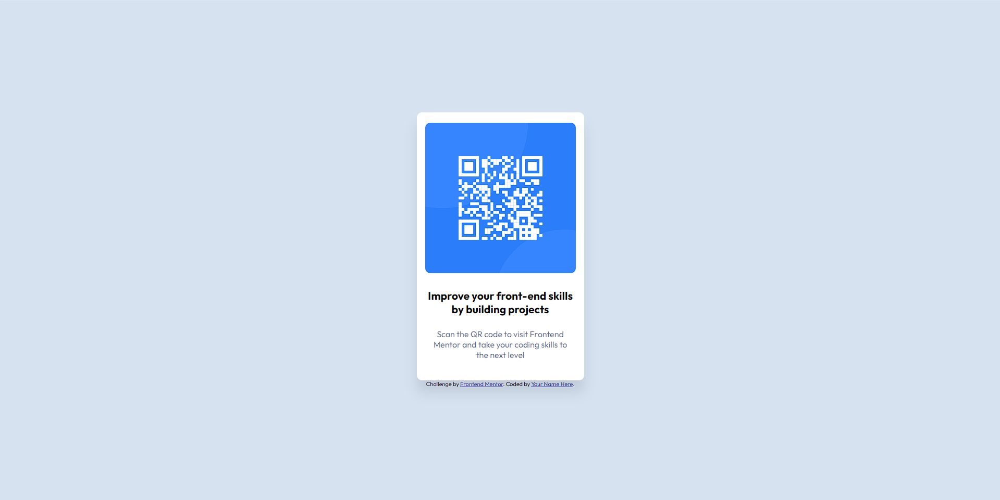

# Frontend Mentor - QR code component solution

This is a solution to the [QR code component challenge on Frontend Mentor](https://www.frontendmentor.io/challenges/qr-code-component-iux_sIO_H). Frontend Mentor challenges help you improve your coding skills by building realistic projects. 

## Table of contents

- [Overview](#overview)
  - [Screenshot](#screenshot)
  - [Links](#links)
- [My process](#my-process)
  - [Built with](#built-with)
  - [What I learned](#what-i-learned)
  - [Continued development](#continued-development)
  - [Useful resources](#useful-resources)
- [Author](#author)

**Note: Delete this note and update the table of contents based on what sections you keep.**

## Overview

### Screenshot

### Links

- Solution URL: [Add solution URL here](index.html)
- Live Site URL: [Add live site URL here](https://ingomiranda.github.io/QR-code-component)

## My process

### Built with

- Semantic HTML5 markup
- CSS custom properties
- Flexbox
- Mobile-first workflow

### What I learned

The project helped me practice my HTML 5 and CSS skills. Before carrying out the coding of the project, I created a prototype in figma to help me in the development.

### Continued development

In the future I intend to expand my knowledge in CSS animations, improve my skills in the field of responsiveness, in addition to gaining more knowledge in the JavaScript language to give more life to my creations.

### Useful resources

## Author

- Instagram - [Add your name here](https://www.instagram.com/ingolima/)
- Frontend Mentor - [@yourusername](https://www.frontendmentor.io/profile/IngoMiranda)
- Github - [@yourusername](https://github.com/IngoMiranda)

